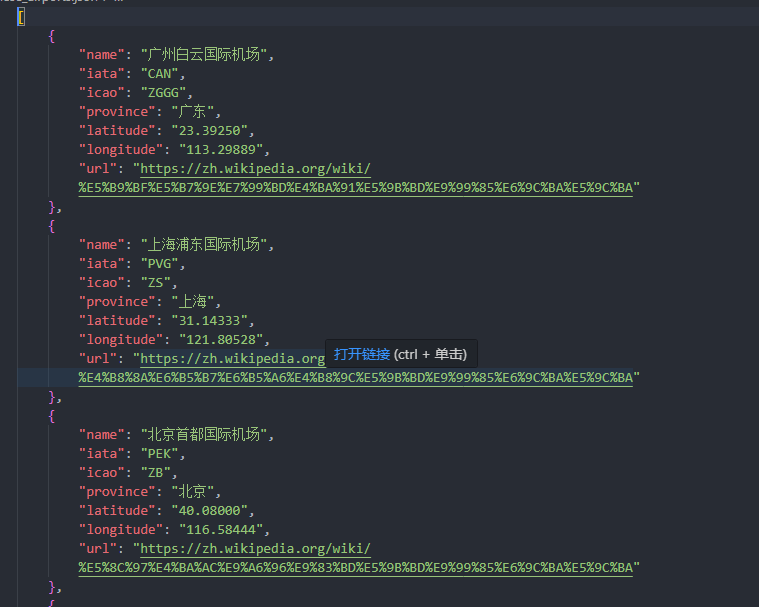

# 中国国内机场和三字码四字码

使用Python写的获取中国国内机场名称和三字码四字码的程序。

感谢豆包。全程由豆包书写。

[机场码Json文件](https://github.com/zhoujia456888/get_airport/blob/master/chinese_airports.json)

[中国机场三字代码/四字码内容网址](https://zh.wikipedia.org/wiki/%E4%B8%AD%E5%8D%8E%E4%BA%BA%E6%B0%91%E5%85%B1%E5%92%8C%E5%9B%BD%E6%9C%BA%E5%9C%BA%E5%88%97%E8%A1%A8)

## 截图

